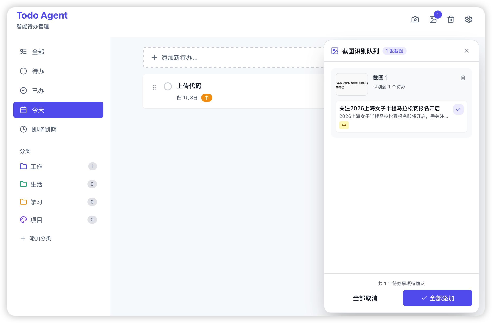

# Todo Agent

待办应用 - 基于 Tauri 2.0 + React 18

## 简介

Todo Agent 是一款简洁优雅的 macOS 待办事项管理应用，具备智能截图识别、云端同步、系统通知等功能。

## 界面预览



## 功能特性

- ✅ **待办管理** - 完整的 CRUD 操作，支持优先级、分类、截止日期
- ✅ **智能识别** - 截图自动提取待办事项（Cmd+Shift+T）
- ✅ **云端同步** - 基于 AWS S3 的多设备同步
- ✅ **系统通知** - 智能到期提醒
- ✅ **分类标签** - 自定义分类和多标签支持
- ✅ **清新界面** - Framer Motion 流畅动画

## 技术栈

| 类别 | 选型 | 说明 |
|------|------|------|
| 框架 | Tauri 2.0 + React 18 | 体积小、性能好 |
| 语言 | TypeScript + Rust | 前后端类型安全 |
| UI | Tailwind CSS + Framer Motion | 清新动画 |
| 状态 | Zustand | 轻量状态管理 |
| 存储 | SQLite | 本地持久化 |
| 同步 | AWS S3 | 云端备份同步 |
| AI | OpenAI GPT-4o-mini | 用户自配置 API Key |

## 快速开始

### 环境要求

```bash
# 检查 Node.js (v18+)
node --version

# 检查 Rust
rustc --version
cargo --version

# 安装 Tauri CLI
cargo install tauri-cli --version "^2.0.0"
```

### 安装依赖

# 安装依赖
npm install --legacy-peer-deps
```

### 运行应用

```bash
# 开发模式（推荐）
./start.sh

# 或手动启动
npm run tauri dev
```

### 构建应用

```bash
npm run tauri build
```

构建产物位于 `src-tauri/target/release/bundle/`

## 配置说明

### 必需配置

**OpenAI API Key** - 用于截图识别功能
1. 启动应用后，点击设置图标
2. 输入 OpenAI API Key
3. 保存设置

### 可选配置

**AWS S3 云端同步**
- S3 Bucket 名称
- AWS Region
- Access Key ID
- Secret Access Key
- 开启"启用云端同步"开关

## 核心功能

### 1. 截图识别 (Cmd+Shift+T)

1. 按下 `Cmd+Shift+T` 或点击相机图标
2. 选择要截取的屏幕区域
3. AI 自动识别待办事项
4. 预览并选择要添加的任务
5. 点击"添加待办"

### 2. 待办管理

| 操作 | 说明 |
|------|------|
| 添加 | 点击"添加新待办..."按钮 |
| 编辑 | 点击待办项的编辑图标 |
| 删除 | 点击删除图标 |
| 完成 | 点击圆圈标记 |

### 3. 分类管理

1. 在侧边栏点击"添加分类"
2. 选择图标和颜色
3. 输入分类名称

### 4. 智能提醒

- 截止前 24 小时提醒
- 截止前 1 小时提醒
- 到期时刻提醒
- 自定义提醒时间
- 应用每30分钟自动检查

### 5. 云端同步

- 每60分钟自动备份
- 应用启动时立即同步
- 智能冲突解决（保留最新）

## 键盘快捷键

| 快捷键 | 功能 |
|--------|------|
| `Cmd+Shift+T` | 触发截图识别 |
| `Escape` | 关闭弹窗/对话框 |

## 构建和发布

### DMG 配置

DMG 打包配置已在 `tauri.conf.json` 中设置：

```json
{
  "bundle": {
    "macOS": {
      "dmg": {
        "appPosition": { "x": 180, "y": 170 },
        "applicationFolderPosition": { "x": 480, "y": 170 },
        "windowSize": { "width": 660, "height": 400 }
      }
    }
  }
}
```

### 发布清单

- [ ] 更新版本号
- [ ] 生成应用图标
- [ ] 运行测试确保功能正常
- [ ] 构建生产版本
- [ ] 签名应用和更新文件
- [ ] 创建 GitHub Release
- [ ] 上传 DMG 文件

## 故障排查

### 应用无法启动

```bash
# 清理端口
lsof -ti:1420 | xargs kill -9

# 清理缓存
rm -rf node_modules
npm install --legacy-peer-deps
```


### 截图功能不工作

- 确保已配置 OpenAI API Key
- 检查系统屏幕录制权限
- 查看控制台错误信息

### 通知不显示

- 检查系统通知权限
- 确保应用在前台或后台运行
- macOS 系统偏好设置 > 通知

### 云端同步失败

- 验证 S3 配置是否正确
- 检查网络连接
- 确认 AWS 凭证有效

## 项目结构

```
todo-agent/
├── src/                        # React 前端
│   ├── components/
│   │   ├── ui/                # 基础组件
│   │   ├── todo/              # 待办组件
│   │   ├── category/          # 分类组件
│   │   └── screenshot/        # 截图组件
│   ├── services/              # API 服务
│   │   ├── openai.ts
│   │   ├── s3.ts
│   │   └── notification.ts
│   ├── stores/                # Zustand 状态
│   ├── lib/                   # 工具和数据库
│   └── styles/                # 全局样式
├── src-tauri/                 # Rust 后端
│   ├── src/
│   │   ├── commands/          # Tauri 命令
│   │   └── main.rs
│   └── tauri.conf.json
└── package.json
```

## 常见问题

**Q: 是否支持 Windows/Linux?**

A: 当前主要支持 macOS，但 Tauri 理论上支持跨平台。

**Q: 截图识别需要网络吗?**

A: 是的，需要调用 OpenAI API。

**Q: 数据存储在哪里?**

A: 本地使用 SQLite 数据库，云端可选择存储到 S3。

**Q: 是否收费?**

A: 应用免费，但 OpenAI API 和 AWS S3 按使用量计费。

## 依赖

### 前端

```json
{
  "react": "^18.3.0",
  "@tauri-apps/api": "^2.0.0",
  "@tauri-apps/plugin-sql": "^2.0.0",
  "zustand": "^5.0.0",
  "framer-motion": "^11.0.0",
  "openai": "^4.70.0",
  "@aws-sdk/client-s3": "^3.600.0"
}
```

### 后端

```toml
tauri = { version = "2", features = ["macos-private-api"] }
tauri-plugin-sql = { version = "2", features = ["sqlite"] }
tauri-plugin-notification = "2"
tauri-plugin-global-shortcut = "2"
```

## 资源链接

- [Tauri 文档](https://tauri.app)
- [Tauri 图标指南](https://tauri.app/v1/guides/features/icons)
- [Tauri 更新器](https://tauri.app/v1/guides/distribution/updater)

---
